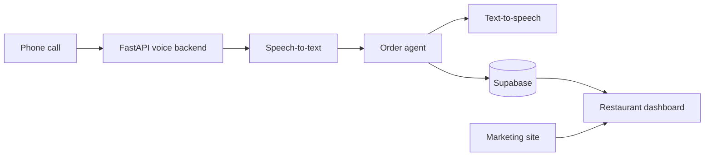

# Respona

> A Danish AI phone agent for restaurants — from a phone call to an order, without staff having to pick up.

[](https://github.com/EnesCkmk1/respona-pov/actions/workflows/ci.yml)
[](LICENSE)
[](#where-are-we-now)

Respona is an open-source proof of value for restaurants that want to automate phone orders. It brings together a marketing site, restaurant dashboard, multi-tenant database, and voice backend in one repository.

## Where are we now?

| Ready now                               | On the path to production                              |
| --------------------------------------- | ------------------------------------------------------ |
| Landing page and restaurant dashboard   | Real authentication and live data                      |
| Danish order flow in stub mode          | Telephony, streaming speech-to-text, and natural voice |
| Multi-tenant Supabase schema with RLS   | EU hosting, consent, and operations                    |
| Simulated calls over REST and WebSocket | Live orders in the dashboard                           |

> **Note:** This is a proof of value, not a production-ready phone agent. The current voice flow simulates the call journey; it does not connect to a live phone number or use real-time speech services yet.

## Architecture



| Area              | Technology                                       |
| ----------------- | ------------------------------------------------ |
| Web and dashboard | React 19, Vite, Tailwind CSS, Cloudflare Workers |
| Data              | Supabase, PostgreSQL, Row Level Security         |
| Voice service     | FastAPI                                          |

## Features

- A Danish landing page for the product
- A restaurant dashboard with order and table views
- Simulated call flows through REST and WebSocket endpoints
- A multi-tenant PostgreSQL schema with Row Level Security policies
- A clear route from proof of value to a real voice stack

## Technology


## Getting started

### 1. Run the web dashboard

```bash
npm install
npm run dev
```

Open `http://localhost:5173`.

### 2. Run the voice backend in stub mode

```powershell
cd backend
python -m venv .venv
.venv\Scripts\activate
pip install -r requirements.txt
uvicorn app.main:app --reload --port 8000
```

The API is then available at `http://localhost:8000`, with interactive documentation at `/docs`.

### 3. Set up the local database

```bash
npx supabase start
npx supabase db reset
```

See [backend/README.md](backend/README.md) for environment variables and the planned production voice architecture.

## Repository guide

```text
src/                    React application and dashboard
workers/                Cloudflare Worker entry points
backend/                FastAPI voice service
supabase/migrations/    PostgreSQL schema and RLS policies
.github/workflows/      Continuous integration
```

## Quality

Every push and pull request runs the project checks in GitHub Actions.

```bash
npm run check
```

## Roadmap

- [ ] Supabase Auth and real restaurant accounts
- [ ] Live order data in the dashboard
- [ ] Telephony integration
- [ ] Streaming speech-to-text and text-to-speech
- [ ] Production agent workflow with human handoff

## Contributing and security

Contributions are welcome. Please read [CONTRIBUTING.md](CONTRIBUTING.md) before opening a pull request. For security issues, follow the private reporting process in [SECURITY.md](SECURITY.md).

## License

Released under the [MIT License](LICENSE).
