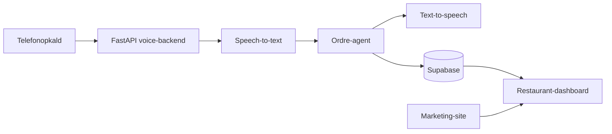

# Respona

> En dansk AI-telefonagent til restauranter — fra opkald til ordre, uden at
> personalet skal løfte røret.

[](https://github.com/EnesCkmk1/respona-pov/actions/workflows/ci.yml)
[](LICENSE)
[](#status)

Respona er et open-source proof of value for restauranter, der vil automatisere
telefoniske bestillinger. Projektet samler et marketing-site, et
restaurant-dashboard, en multi-tenant database og en voice-backend i ét repo.

## Hvor står vi?

| Klar nu                                 | På vej til produktion                      |
| --------------------------------------- | ------------------------------------------ |
| Landing page og restaurant-dashboard    | Ægte login og live-data                    |
| Ordre-flow i dansk stub-mode            | Telefoni, streaming-STT og naturlig stemme |
| Multi-tenant Supabase-skema med RLS     | EU-hosting, samtykke og produktionsdrift   |
| Simulerede opkald via REST og WebSocket | Realtime-ordrer i dashboardet              |

> [!IMPORTANT]
> Dette er en PoV — ikke en produktionsklar telefoniløsning endnu. Den kører
> bevidst uden betalte AI- eller telefoni-API'er som standard.

## Arkitektur



| Del             | Teknologi                                    | Formål                                           |
| --------------- | -------------------------------------------- | ------------------------------------------------ |
| Web + dashboard | React 19, Vite, Tailwind, Cloudflare Workers | Landing page, kontaktformular og restaurant-UI   |
| Data            | Supabase, Postgres, RLS                      | Tenant-isolation, menukort, ordrer og opkaldslog |
| Voice           | FastAPI                                      | Telefoni → STT → agent → TTS samt ordre-API      |

## Funktioner

- Dansk ordreagent med menu-matching, antalforståelse, kurv og afslutning.
- Dashboard med ordrer, menukort, tilgængelighed og restaurantindstillinger.
- Simuleret opkald, der kan oprette en ordre helt uden API-nøgler.
- Tenant-isolation via Supabase RLS.
- Kontaktformular med rate limiting, honeypot, CORS og security headers.
- CI på alle pushes og pull requests.

## Kom i gang

### 1. Web og dashboard

```bash
npm install
npm run dev
```

Åbn [http://localhost:5173](http://localhost:5173) — dashboardet ligger på
`/dashboard`.

### 2. Voice-backend i stub-mode

```bash
cd backend
python -m venv .venv
.venv\Scripts\activate
pip install -r requirements.txt
uvicorn app.main:app --reload
```

API-dokumentationen er derefter på [http://localhost:8000/docs](http://localhost:8000/docs).

Prøv et komplet simuleret opkald:

```bash
curl -X POST http://localhost:8000/restaurants/00000000-0000-0000-0000-000000000001/simulate-call \
  -H "Content-Type: application/json" \
  -d '{"utterances":["Hej, jeg vil bestille to margherita","Og en cola","Det var det, tak"]}'
```

### 3. Lokal database (valgfrit)

```bash
cd supabase
supabase start
supabase db reset
```

Det kræver Docker. Se også [supabase/README.md](supabase/README.md) og
[backend/README.md](backend/README.md) for opsætning og API-detaljer.

## Repo-guide

```text
src/         React-app: marketing-site og /dashboard
backend/     FastAPI voice-backend og ordre-agent
supabase/    Database, RLS-migrations og dev-seed
migrations/  Cloudflare D1 for kontaktformularen
.github/     CI-workflow
```

## Kvalitet

```bash
npm run check
```

Kommandoen validerer formattering, lint og TypeScript. Den samme kontrol kører
automatisk i GitHub Actions på hver push og pull request.

## Roadmap

1. Forbind dashboardet med FastAPI-backenden med mock-fallback.
2. Tilføj Supabase Auth, ægte ordrer og Realtime.
3. Tilføj test-suite for menu-matching, totaler og ordreafslutning.
4. Integrér telefoni, streaming-STT, LLM og TTS — én provider ad gangen.
5. Gør produktion klar med EU-region, samtykke ved optagelse og robust drift.

## Bidrag og sikkerhed

Bidrag er velkomne. Læs [CONTRIBUTING.md](CONTRIBUTING.md), før du åbner en
pull request. Sikkerhedsproblemer rapporteres privat efter
[SECURITY.md](SECURITY.md).

**Commit aldrig** API-nøgler, telefonnumre, kundeoplysninger eller
opkaldsoptagelser. Brug `.env.example` og `backend/.env.example` som
skabeloner.

## Licens

Respona er udgivet under [MIT-licensen](LICENSE). Du må frit bruge, ændre og
distribuere koden — også kommercielt — når licensnoticen bevares.
